# Gmail G Suite
  
Conecte-se por meio da API do Google à sua conta do Gmail, leia, envie e gerencie sua caixa de entrada de e-mail, marcadores e pastas.  

*Read this in other languages: [English](Manual_gmail_suite.md), [Português](Manual_gmail_suite.pr.md), [Español](Manual_gmail_suite.es.md)*
  

## Como instalar este módulo
  
Para instalar o módulo no Rocketbot Studio, pode ser feito de duas formas:
1. Manual: __Baixe__ o arquivo .zip e descompacte-o na pasta módulos. O nome da pasta deve ser o mesmo do módulo e dentro dela devem ter os seguintes arquivos e pastas: \__init__.py, package.json, docs, example e libs. Se você tiver o aplicativo aberto, atualize seu navegador para poder usar o novo módulo.
2. Automático: Ao entrar no Rocketbot Studio na margem direita você encontrará a seção **Addons**, selecione **Install Mods**, procure o módulo desejado e aperte instalar.  

# Como usar este modulo

*Read this in other languages: [English](how_to_use.md), [Portugues](how_to_use.pr.md), [Español](how_to_use.es.md).*

Para trabalhar com este módulo é necessário ativar a API do Gmail. Para isso, você deve seguir os seguintes passos.
* Ir para o [Google Console](https://console.cloud.google.com/projectcreate?previousPage=%2Fhome%2Fdashboard%3Fproject%3Dprueba-312216%26hl%3Des&folder=&organizationId=777182023349&hl=es) para criar um novo projeto (caso já tenha criado, pule esta etapa) e preencha os dados indicados no formulário

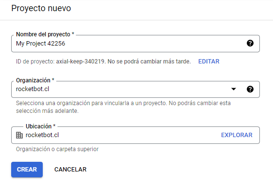

Na barra superior você verá o nome do projeto. Caso não seja exibido, mude para o projeto criado clicando em no menu que está destacado na imagem.

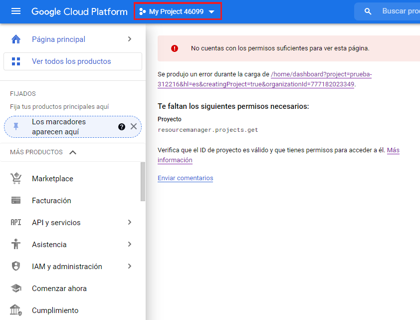

Se você receber a mensagem "Você não tem permissões suficientes para visualizar esta página". Conforme mostrado na imagem acima, clique em **API and Services** no painel esquerdo e, após mudar para a página, clique em **ENABLE 
API AND SERVICES**

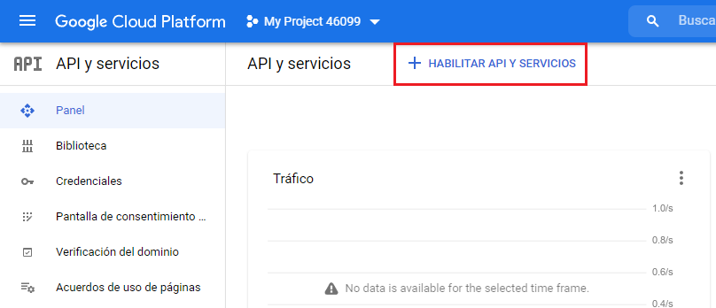

No mecanismo de pesquisa "APIs e serviços de pesquisa", digite **Gmail API**. Em seguida, ative a API clicando em **Ativar**

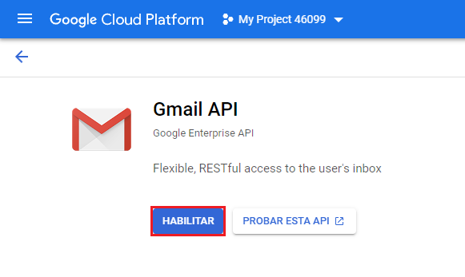

Levará um momento para carregar e a página será redirecionada para a página de configurações da API.

* Clique em **CRIAR CREDENCIAIS**, para criar as credenciais

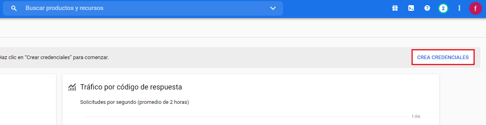

O primeiro passo é selecionar o tipo de credencial. Selecionamos **Gmail API** e marcamos a opção **User data**. Em seguida, clique em próximo.

Na tela de consentimento, digite um nome para o aplicativo e selecione um email.

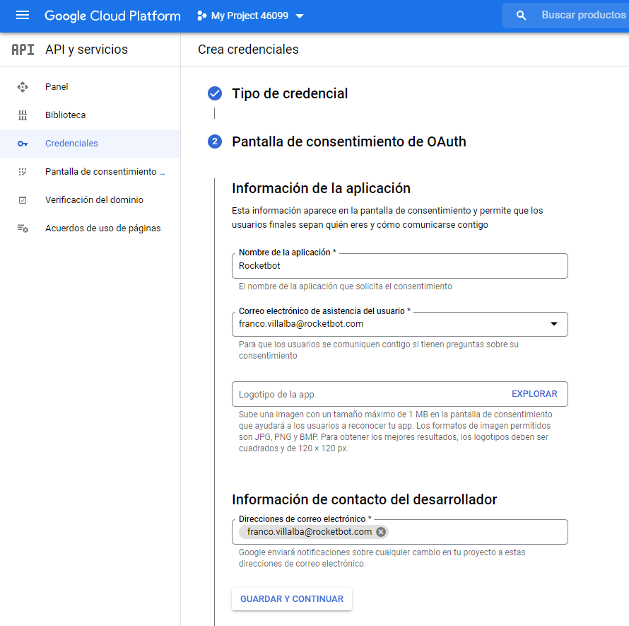

Na tela de permissões, clique em **ADICIONAR OU REMOVER PERMISSÕES**. Um modal será aberto para selecionar as permissões. No tipo de filtro **Gmail API**, clique no menu suspenso **Linhas por página** e selecione **100** para ver todas as opções, selecione todas marcando **API** e clique em 
**Atualizar**.

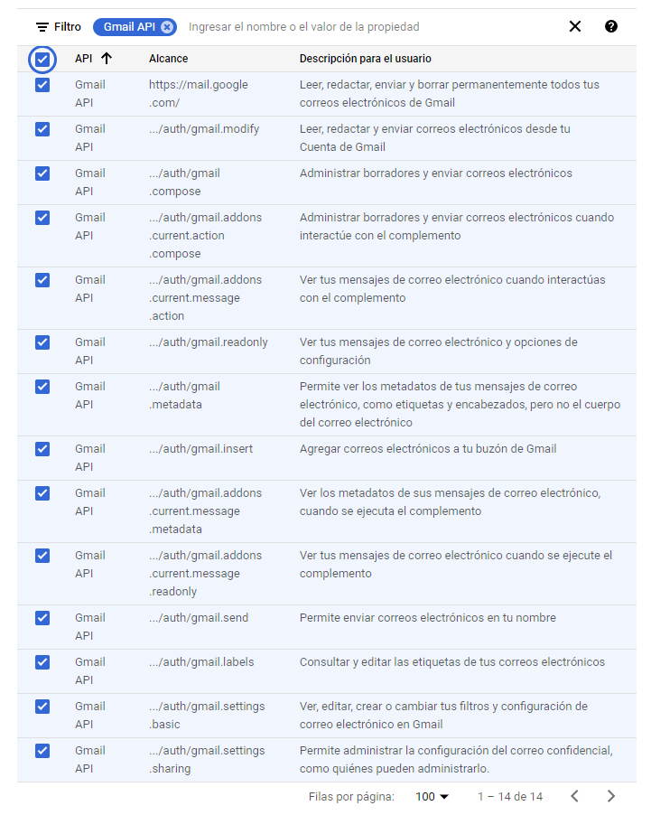

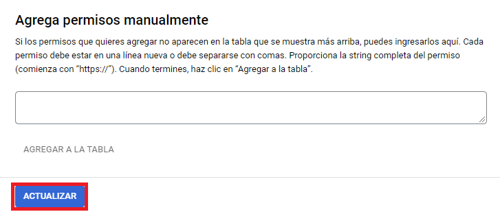

Depois que as permissões selecionadas forem adicionadas, clique em **SALVAR E CONTINUAR**

Por fim, na tela OAuth, selecione o tipo de aplicativo **Desktop APP** e adicione um nome. Finalizamos clicando em criar.

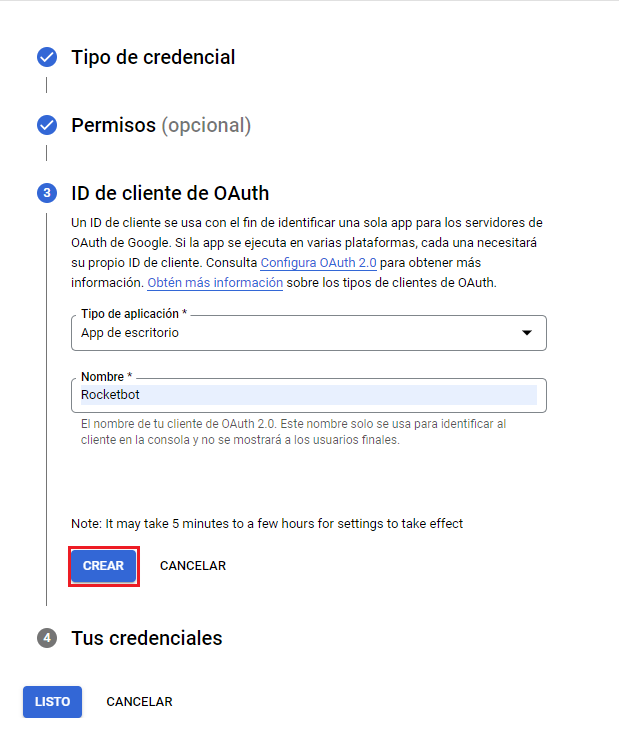

Ele irá criar as credenciais para nós, clicamos em download e depois em pronto. É importante manter o arquivo baixado. Ele será usado posteriormente no módulo.

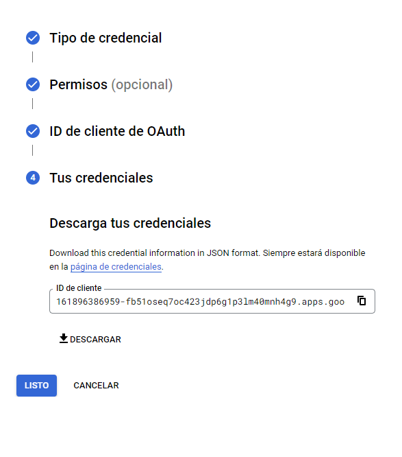

No menu à esquerda, ao clicar em **Tela de consentimento**, caso você tenha uma conta corporativa do Gmail, poderá usar a API por tempo indeterminado e verá que o tipo de usuário é **Interno**. Se você tiver uma conta gratuita do Gmail, terá que dar consentimento uma vez por semana para poder se conectar à sua conta de e-mail e verá que seu tipo de usuário é **Externo** e terá que adicionar usuários de teste.

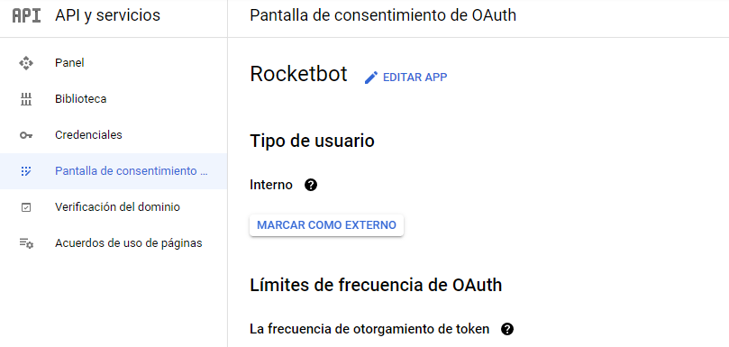

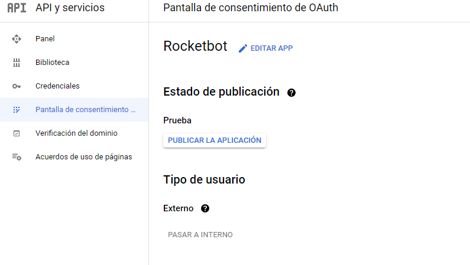

Para evitar 
cometer todas as semanas, você pode publicar o aplicativo para aprovação do Google e usá-lo indefinidamente.
## Descrição do comando

### Configuração do servidor
  
Configure o servidor de email a ser usado
|Parâmetros|Descrição|exemplo|
| --- | --- | --- |
|Credenciais|Caminho do arquivo json baixado na etapa anterior|credentials.json|
|Porto (Opcional)||8080|
|Usuário|E-mail que será usado para enviar e-mails. Pode ficar em branco se você não quiser enviar e-mail|user@example.com|
|Sessão|Nome da sessão que vamos atribuir|session1|
|Atribuir resultado à variável|Resultado da conexão|Variável|

### Enviar Email
  
Envia um email, você deve configurar previamente o servidor
|Parâmetros|Descrição|exemplo|
| --- | --- | --- |
|Sessão|Nome da sessão a ser usada|session1|
|Para|Destinatários da mensagem. Devem ser separados por vírgulas|to@mail.com, to2@mail.com|
|Copia|Destinatários enviados por cópia. Devem ser separado por vírgula|cc@mail.com, cc2@mail.com|
|Cópia oculta|Destinatários enviados por cópia oculta. Devem ser separado por vírgula|bcc@mail.com, bcc2@mail.com|
|Assunto|Assunto da mensagem|Novo mail|
|Mensagem|Corpo do e-mail. tags html podem ser usadas|Hi from Rocketbot!|
|Arquivo anexo|Caminho do arquivo a ser anexado|C:\User\Desktop\test.txt|
|Pasta (vários arquivos)|Caminho da pasta com os arquivos a serem anexados|C:\User\Desktop\Files|
|Atribuir resultado à variável|Resultado da conexão|Variável|

### Listar todos os e-mails
  
Liste todos os e-mails, você pode especificar um filtro
|Parâmetros|Descrição|exemplo|
| --- | --- | --- |
|Filtro|Você pode usar todas as opções de filtro do Gmail.|subject:ESCOLA|
|Número de e-mails a obter|Número de e-mails a obter, por padrão 100, máximo 500.|500|
|Pasta|Pasta de onde todos os emails não estão listados|INBOX|
|Organizar por|Classifique os emails listados pelo parâmetro desejado|New first|
|ID do tópico|Verifique para obter o ID do tópico da mensagem|True|
|Sessão|Nome da sessão a ser usada|session1|
|Atribuir à variável|Nome da variável onde a lista de e-mail será salva|Variável|

### Lista de e-mail não lida
  
Listar e-mails não lidos, você pode especificar um filtro
|Parâmetros|Descrição|exemplo|
| --- | --- | --- |
|Filtro|Você pode usar todas as opções de filtro do Gmail|subject:ESCOLA|
|Pasta|Especifique o nome da pasta de onde você deseja obter os e-mails, por padrão, caixa de entrada|inbox|
|Sessão|Nome da sessão a ser usada|session1|
|Organizar por|Classifique os emails listados pelo parâmetro desejado|New first|
|Atribuir à variável|Nome da variável onde a lista de e-mail será salva|variável|

### Ler email por ID
  
Você pode especificar o ID de um email para lê-lo
|Parâmetros|Descrição|exemplo|
| --- | --- | --- |
|ID do email|Id obtido nos comandos para listar email|345|
|Sessão|Nome da sessão a ser usada|session1|
|Atribuir à variável|Nome da variável onde o conteúdo do e-mail lido será salvo|variável|
|Caminho para baixar anexos|Caminho da pasta onde os anexos serão salvos|C:\User\Desktop|

### Obter thread por ID
  
Obtenha todo o tópico de um e-mail por ID
|Parâmetros|Descrição|exemplo|
| --- | --- | --- |
|ID do tópico|Id obtido nos comandos para listar email|345|
|Formato|Formato dos dados retornados|Full|
|Sessão|Nome da sessão a ser usada|session1|
|Atribuir à variável|Nome da variável onde o conteúdo do e-mail lido será salvo|variável|

### Criar marcador
  
Você pode criar uma marcador com o nome que quiser
|Parâmetros|Descrição|exemplo|
| --- | --- | --- |
|Nome do marcador|Nome da tag a ser criada|Digite o nome da marcador|
|Sessão|Nome da sessão a ser usada|session1|

### Mover e-mail para marcador
  
Mover e-mail de um marcador para outro
|Parâmetros|Descrição|exemplo|
| --- | --- | --- |
|ID do email|ID obtido nos comandos para listar email|345|
|Nome do marcador|Marcador para onde o e-mail será movido|new|
|Nome do marcador a ser removido|Marcador a ser removido do e-mail (opcional)|old|
|Sesión|Nome da sessão a ser usada|session1|
|Atribuir resultado à variável|Variável onde será salvo. True se o email foi movido. Caso contrário, retornará False|variável|

### Marcar e-mail como não lido
  
Qualquer email aberto anteriormente pode ser marcado como não lido
|Parâmetros|Descrição|exemplo|
| --- | --- | --- |
|ID do email|ID obtido nos comandos para listar email|Digite o ID do e-mail|
|Sessão|Nome da sessão a ser usada|session1|

### Listar todos os marcadores
  
Obtenha uma lista de todos os marcadores de correio e armazene-as em uma variável
|Parâmetros|Descrição|exemplo|
| --- | --- | --- |
|Sessão|Nome da sessão a ser usada|session1|
|Listar todos os dados|Verifique se você deseja obter todos os dados da tag, como id, nome, visibilidade etc. Se não estiver marcado, apenas o id será obtido.|True|
|Atribuir à variável|Variável onde os marcadores serão salvos|variável|

### Reenviar
  
Reenviar um email
|Parâmetros|Descrição|exemplo|
| --- | --- | --- |
|Sessão|Nome da sessão a ser usada|session1|
|ID Mail|ID obtido nos comandos para listar email|321|
|Para|Destinatários da mensagem. Devem ser separados por vírgulas|to@mail.com, to2@mail.com|
|Cópia|Destinatários enviados por cópia. Devem ser separados por vírgulas|cc@mail.com, cc2@mail.com|
|Cópia oculta|Destinatários enviados por cópia oculta. Devem ser separados por vírgulas|bcc@mail.com, bcc2@mail.com|
|Assunto|Assunto da mensagem|Novo email|

### Responder email
  
Este comando permite responder um email por seu ID
|Parâmetros|Descrição|exemplo|
| --- | --- | --- |
|Sessão|Nome da sessão a ser usada|session1|
|ID Mail|ID obtido nos comandos para listar email|321|
|Para|Destinatários da mensagem. Devem ser separados por vírgulas|to@mail.com, to2@mail.com|
|Cópia|Destinatários enviados por cópia. Devem ser separados por vírgulas|cc@mail.com, cc2@mail.com|
|Cópia oculta|Destinatários enviados por cópia oculta. Devem ser separados por vírgulas|bcc@mail.com, bcc2@mail.com|
|Assunto|Assunto da mensagem|Novo email|

### Baixar anexos por ID
  
Baixe anexos de e-mail e salve-os em uma pasta
|Parâmetros|Descrição|exemplo|
| --- | --- | --- |
|Email ID|ID do e-mail a ser lido|345|
|Sessão|Sessão do Gmail|Default|
|Caminho para baixar anexos|Caminho onde os anexos serão salvos|C:/User/Desktop|

### Fechar conexão
  
Feche a conexão do servidor
|Parâmetros|Descrição|exemplo|
| --- | --- | --- |
|Sessão|Nome da sessão a ser usada|session1|
